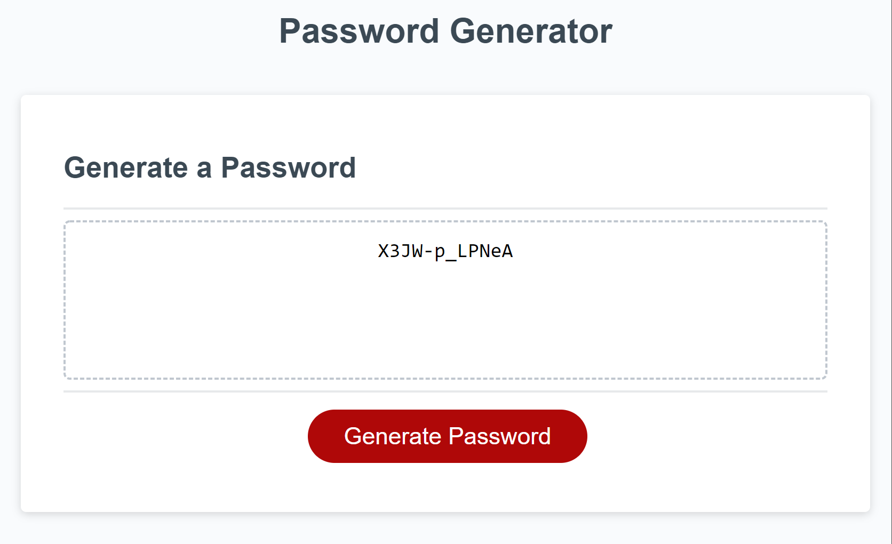

# Homework 3 - Password Generator

Password Generator can generate a random password with your choice of length and character types. Includes support for alphanumeric values and symbols. The generator uses Math.random() as a means of generating a character from a collection of predetermined character sets which includes uppercase and lowercase letters, numbers (0-9), and symbols.

Deployed repo: https://jlamonade.github.io/Password-Generator/

Screenshot:

